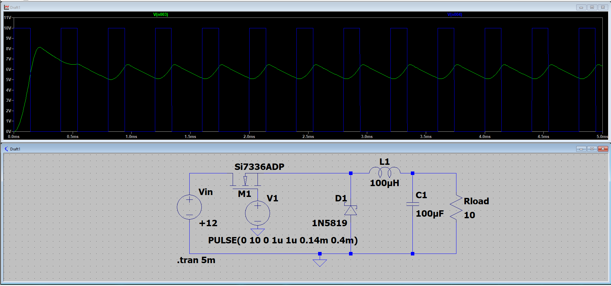
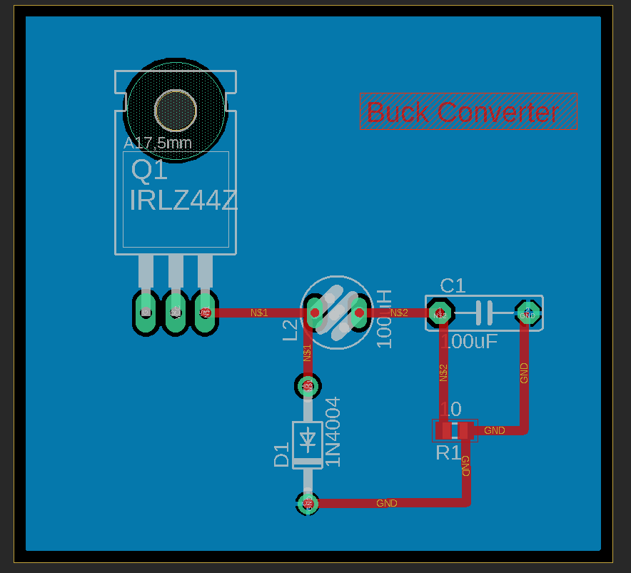

# Power Electronics Project: DC-DC Buck and Boost Converter (LTspice)

This project focuses on the design and simulation of DC-DC power converters using LTspice.
The main objective is to understand the operating principles of **Buck (step-down)** and **Boost (step-up)** converters and analyze their electrical behavior through simulation.

In this project, a Buck converter circuit is designed and simulated to observe switching behavior, current waveforms, and output voltage characteristics.

---

## Project Overview

This project demonstrates the design and simulation of a **DC-DC Buck Converter** using LTspice.
The converter steps down a **12V input voltage** to a lower output voltage using PWM switching control.

Key features analyzed in this project:

* PWM switching behavior
* Inductor current waveform
* Output voltage ripple
* Basic converter performance

---

## Project Goals

* Understand how DC-DC converters work
* Design a Buck converter circuit
* Design a Boost converter circuit
* Simulate the circuits in LTspice
* Observe voltage and current waveforms
* Analyze output voltage ripple
* Study switching behavior in power electronic converters

---

## Buck Converter Circuit

The circuit consists of a MOSFET switching device, a diode, an inductor, a capacitor, and a resistive load.
The MOSFET is driven by a PWM signal that controls the duty cycle and therefore regulates the output voltage.

---

## Converter Specifications

| Parameter           | Value   |
| ------------------- | ------- |
| Input Voltage       | 12 V    |
| Inductor            | 100 µH  |
| Capacitor           | 100 µF  |
| Load Resistance     | 10 Ω    |
| Switching Frequency | 2.5 kHz |
| Duty Cycle          | ~35%    |

---

## Buck Converter Simulation Results

### PWM Gate Signal and Output Voltage

This waveform shows the PWM gate signal applied to the MOSFET and the resulting output voltage of the Buck converter.

The duty cycle of the PWM signal determines the average output voltage according to the basic Buck converter relationship.

---

### Inductor Current

The inductor current waveform has a triangular shape which is characteristic of Buck converters operating in continuous conduction mode.

During the ON state, the inductor stores energy.
During the OFF state, the inductor releases energy to the load through the diode.

---

### Output Voltage Ripple

The output voltage ripple appears due to the switching operation of the converter.
The LC filter reduces the ripple and provides a more stable DC output voltage.

---

## Simulation Analysis

The simulation confirms the expected behavior of a Buck converter:

* The output voltage is lower than the input voltage due to duty cycle control.
* The inductor current follows a triangular waveform.
* The capacitor reduces voltage ripple at the output.
* PWM switching controls the energy transfer from input to load.

These results demonstrate the fundamental operating principles of DC-DC power converters.

---

## Buck Converter Operating Principle

A Buck converter is a DC-DC step-down converter that reduces the input voltage to a lower output voltage using high-frequency switching.

The converter operates in two main switching states:

**Switch ON State**

* The MOSFET conducts.
* The inductor stores energy.
* Current increases through the inductor.
* The load receives energy from the input source.

**Switch OFF State**

* The MOSFET turns OFF.
* The diode conducts.
* The inductor releases stored energy to the load.
* The capacitor helps maintain a smooth output voltage.

By controlling the **PWM duty cycle**, the average output voltage of the converter can be regulated.

---
## PCB Design

After completing the simulation phase, the Buck Converter circuit was implemented as a printed circuit board (PCB) using Autodesk EAGLE.

The PCB design includes:
- IRLZ44Z power MOSFET
- 1N4004 freewheeling diode
- 100 µH inductor
- 100 µF output capacitor
- 10 Ω load resistor

A ground plane was added to improve current return paths and reduce noise in the switching converter.

### PCB Layout

---
## Project Structure

* `docs/` → theory notes and design explanations
* `simulations/` → LTspice simulation files
* `results/` → simulation analysis and observations
* `pcb/` → PCB preparation notes
* `images/` → simulation screenshots used in the README

---

## Tools Used

* LTspice
* Power Electronics design principles
* Basic circuit analysis
* GitHub for project documentation
